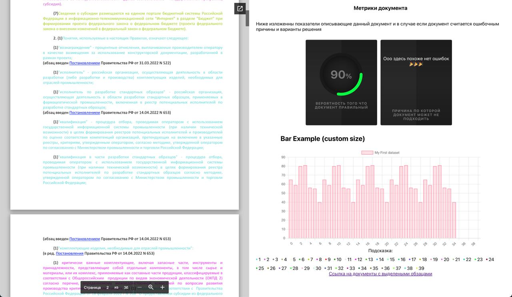

# DocSuggestor

Наш сервис сделает всю работу за вас :)))



Наш сервис помогает проверить юридические документы на наличие юридических ошибок
Сервис на данный момент работает только с документами типа .docx/.doc,
будьте внимательнее если будете загружать другие документы(в таком случае вы получите ошибку 451 с сотвествующим пояснением)


Сервис поддерживает две точки входа:

- REST API [Ссылка на сваггер]()
- Frontend Side [ссылка на фронт]()

## REST API

### Authorization:

Python request sample:

```python
import requests

url = 'http://0.0.0.0:49154/process_the_document/'
token = ''
path_to_file = "file.docx"
f = open(path_to_file, 'rb')

resp = requests.post(url, json=f, headers={'Authorization': f'Bearer {token}'})
print(resp.__dict__)
```

### POST /process_the_document

Это метод который принимает на вход документ и отдает результат работы сервисаю

Request

```json
{
  "place_holder": 0
}
```

Arguments:

* place_holder

Responce

```json
{
  "place_holder": 0
}
```


### CLI for recurring operations management

...

## Installation

### Pre installation requirements:

* python >= 3.9.0

* Set environment variable list

```bash
export AUTHORIZATION_TOKEN={set here your athorization token}
export SERVER_IP={set here your server ip}
export API_PORT={set here your ip port}
```

### Installation:

### Text search api installation:

0) Create and activate clear python3 environment


1) run:

```bash
pip install -r requirements/text_search_api_req.txt
```

2) run:

```bash
python download.py
```

### Setting up apis:

* ### DocApi

1) run:

```bash
python python run_api.py
```

2) Add "/docs" at the end and open the link, which you can get from console 


